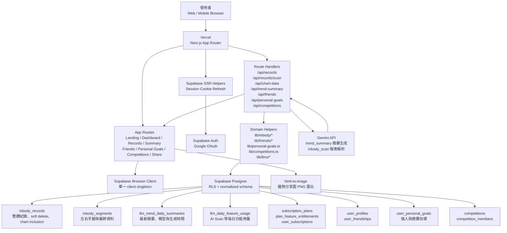

# InsightUp Landing 文件

## 一句話定位

InsightUp 是一個把 InBody 紀錄整理成長期趨勢洞察的健康追蹤工具。它不要求使用者追蹤每一個數字，而是幫助使用者分辨哪些紀錄值得進入分析、哪些只是短期雜訊，最後把身體組成變化轉成可理解、可行動、可分享、可追蹤目標進度的長期系統。

## 1. 為什麼需要 InsightUp

### 痛點一：InBody 報表資訊太多，但真正能行動的洞見太少

多數人量完 InBody 後，會拿到一張充滿體重、骨骼肌、體脂肪、體脂率、內臟脂肪、基礎代謝、左右手腳肌肉量等指標的報表。問題不是資料不夠，而是資料太多。

使用者常見的狀況是：

- 只看體重，忽略肌肉與脂肪的比例變化。
- 看到體脂率上升就焦慮，但不知道是短期水分、飲食、睡眠或測量條件造成。
- 每次量完都截圖或拍照保存，但幾個月後很難回頭比較。
- 報表看起來很專業，實際上卻沒有轉化成下一步行動。

### 痛點二：每筆紀錄都進入圖表，反而會追到雜訊

InBody 測量很容易受到量測時間、喝水量、運動後狀態、飲食、睡眠與生理狀態影響。不是每一筆數據都適合拿來代表趨勢。

例如，一位使用者小安正在減脂。她每兩週量一次 InBody，前兩個月肌肉量穩定、體脂緩慢下降。某天她在重訓後馬上測量，結果體脂率看似上升、肌肉量也異常波動。如果這筆資料直接進入長期圖表，她可能會以為訓練方向錯了，甚至開始調整飲食或減少訓練。

InsightUp 的核心假設是：保留紀錄很重要，但不是每筆紀錄都應該影響分析。

### 痛點三：長期追蹤不夠久，趨勢看不出來

身體組成不是每天都有明顯變化。真正重要的通常是三個月、半年、一年後的方向：

- 體重是否下降但肌肉也流失？
- 體重差不多，但體脂是否下降、肌肉是否上升？
- 左右側肌肉是否逐漸不平衡？
- 內臟脂肪與基礎代謝是否有穩定改善？

一般使用者常在短期變化中來回焦慮，卻缺少一個能把資料拉長、整理、篩選與解讀的工具。

### 痛點四：單純社交比較的效果有限

健康追蹤產品常加入排行榜、朋友比較或成就徽章，但 InBody 數據高度個人化。不同性別、年齡、訓練背景、目標與生活型態之間，直接比較體重、體脂或肌肉量，往往無法產生真正有效的行動。

對多數使用者來說，最有價值的不是「我跟別人誰比較好」，而是：

- 我是不是比過去的自己更接近目標？
- 這段時間的變化是否符合訓練與飲食策略？
- 哪些資料可能只是雜訊，不該過度反應？
- 下一步應該先關注哪幾個指標？

InsightUp 因此把核心放在個人長期洞察，再把社交設計轉成朋友快照、差異比較、個人目標與共同挑戰，而不是只做表面的排名刺激。

### InsightUp 的差異化優勢

- 不是只保存 InBody 紀錄，而是讓使用者控制「哪些資料該進入分析」。
- 不是單純社交排名，而是把社交轉成朋友快照、目標追蹤、差異比較與共同挑戰。
- 不是每次打開都重新問 AI，而是分離最新摘要讀取、明確重新生成與每日額度控管。
- 不是讓 AI Scan 直接污染正式資料，而是先產生 draft，再由使用者人工確認。
- 不是為了 MVP 犧牲後續擴充，而是用單一 Next.js + Supabase + Vercel 架構降低初期成本，同時保留 API 拆分與商業化升級空間。

## 2. InsightUp 的使用者功能與實用價值

### Google 登入與個人化資料空間

使用者可以用 Google 登入，進入自己的 Dashboard、Records、AI 摘要、個人目標、朋友、競賽與 Account。所有 InBody 紀錄都綁定個人帳號，避免資料散落在手機相簿、聊天紀錄或紙本報表裡。

使用者可以達成的目的：

- 建立自己的身體組成資料庫。
- 在不同裝置上延續紀錄。
- 用帳號權限保護個人健康資料。
- 在同一個產品內串起紀錄、趨勢、目標、朋友與挑戰。

### InBody 紀錄管理

使用者可以新增、編輯與刪除 InBody 紀錄。每筆紀錄可包含整體指標與區域指標，例如體重、肌肉量、體脂肪、體脂率、內臟脂肪、基礎代謝，以及左右手、軀幹、左右腳等 segmental 數據。

使用者可以達成的目的：

- 把零散報表整理成可追蹤資料。
- 回頭查看每次量測的日期、備註與資料來源。
- 在資料輸入錯誤時修正，而不是留下錯誤歷史。
- 用 soft delete 隱藏不再需要的紀錄，同時保留資料復原與稽核空間。

### Included / Excluded 圖表納入機制

InsightUp 區分「保留紀錄」與「納入圖表分析」。一筆資料可以存在於歷史紀錄中，但不進入趨勢圖。

使用者可以達成的目的：

- 保留可疑紀錄，不需要直接刪除。
- 排除運動後、飲食後、狀態異常或明顯失真的測量值。
- 讓圖表更接近真實長期趨勢。
- 降低因短期波動做出錯誤判斷的機率。

### AI Scan 快速輸入

InsightUp 已支援 AI Scan 作為快速輸入路徑。使用者可以上傳 JPG、PNG、WebP 或 PDF 檔案，系統透過 Gemini 抽取清楚可見的 InBody 欄位，並回填到新增紀錄表單。

AI Scan 採 review-first 原則：

- 只讀取清楚可見的欄位。
- 模糊、裁切、不確定或衝突的欄位會保留空白。
- 掃描結果會先成為表單 draft，不會直接寫入正式紀錄。
- 使用者確認後才建立紀錄，避免辨識錯誤污染長期趨勢。
- 使用次數由方案權益與每日額度控制。

使用者可以達成的目的：

- 降低手動輸入整張報表的成本。
- 保留人工確認權，避免錯誤資料自動入庫。
- 快速建立包含整體與部位資料的紀錄草稿。

### 導入前一次紀錄

新增紀錄時，使用者可以導入最近一次 InBody 數值，再保留當天日期與目前備註進行微調。

使用者可以達成的目的：

- 固定量測者可以快速建立相近資料，不必每次從零輸入。
- 適合只有少數欄位變動、或先建立草稿再補細節的使用情境。
- 降低長期追蹤的摩擦，提高持續記錄率。

### Overall 與 Segmental 趨勢切換

Dashboard 的主圖表支援整體與部位視角切換。使用者可以從整體指標看到體重、肌肉、脂肪與分數變化，也能切換到左手、右手、軀幹、左腳、右腳等區域觀察。

使用者可以達成的目的：

- 看出全身變化方向。
- 觀察局部肌肉或脂肪變化。
- 發現左右側差異與訓練不平衡。
- 將訓練策略從「只看體重」提升到「看身體組成」。

### Dashboard 個人化趨勢工具

Dashboard 不只顯示圖表，也提供更適合長期使用的趨勢閱讀工具：

- 單欄與雙欄版面切換。
- 指標顯示與隱藏控制。
- 趨勢線顯示。
- 指標排序偏好保存。
- Dashboard 與 Records 分工，前者讀趨勢，後者管理資料。

使用者可以達成的目的：

- 依照自己的追蹤重點調整圖表密度。
- 在手機與桌面上用不同版面看資料。
- 把最在意的指標放在更容易看到的位置。

### AI 趨勢摘要

InsightUp 的 AI 趨勢摘要會先讀取最新可用摘要，只有在使用者明確按下重新生成時才呼叫模型。摘要輸入會優先使用壓縮後的近期紀錄，包含整體與部位資料。

使用者可以達成的目的：

- 快速理解最近幾筆紀錄的趨勢。
- 不必逐項解讀複雜報表。
- 得到更接近「下一步該看什麼」的提示。
- 避免每次打開畫面都重新消耗 AI 額度。

### 趨勢分享圖

InsightUp 提供 `/share` 分享工具，可根據使用者自己的 InBody 紀錄產生可下載的趨勢圖。分享畫面支援趨勢或目前狀態樣式、背景、標題、版面、顯示指標與顏色調整，並透過前端圖片匯出工具產生 PNG。

使用者可以達成的目的：

- 將長期變化整理成適合分享的視覺成果。
- 對教練、朋友或社群呈現重點，而不是貼整張複雜報表。
- 控制要公開哪些指標與視覺樣式，降低隱私暴露。

### 個人目標

使用者可以從最新 InBody 數值建立個人目標，追蹤體重、骨骼肌量、體脂肪量、體脂率、InBody 分數、內臟脂肪等級、基礎代謝率與建議熱量等指標。

使用者可以達成的目的：

- 把「想變好」轉成具體數值目標。
- 同一組目標可以包含多個指標，例如減脂、增肌與改善體脂率。
- 透過進度條查看目前進展。
- 回顧起始紀錄、參考紀錄與目標日期，讓追蹤更有上下文。

### 朋友系統與比較

使用者可以透過好友 ID 新增朋友。朋友頁會顯示對方最新 InBody 快照，並可查看朋友趨勢與和自己的最新紀錄差異。

使用者可以達成的目的：

- 讓社交不只是排名，而是保留彼此近況與差異。
- 適合教練、夥伴或小團體互相追蹤。
- 透過可控的好友關係查看資料，而不是公開所有健康紀錄。

### 競賽與共同挑戰

InsightUp 支援建立競賽，設定共同目標日期，邀請朋友加入。受邀者可以接受或婉拒，加入後可設定自己的競賽目標，系統以各自目標進度產生排行榜。

使用者可以達成的目的：

- 將社交動機轉成可追蹤的共同挑戰。
- 每個人可以依照自己的身體狀態設定目標，不必用同一個絕對數字硬比。
- 用目標進度而不是單次體重或體脂高低比較表現。
- 支援個人、朋友群、教練班級與工作室會員挑戰。

目前競賽分享功能仍屬後續延伸，現階段重點是競賽建立、成員邀請、目標設定與排行榜追蹤。

### 方案與使用限制

AI 使用限制由資料庫中的方案與功能權益控制，而不是寫死在程式碼裡。目前預設免費方案可提供有限 AI 摘要與 AI Scan 額度，後續可擴充付費方案、模型池與功能差異。

使用者可以達成的目的：

- 明確知道自己目前方案與可用功能。
- 在未來付費方案中取得更高額度或更進階模型。
- 讓產品成長時不需要重寫核心權限邏輯。

## 3. 如何導入商業計畫

### 商業定位

InsightUp 適合切入以下市場：

- 正在減脂、增肌、體態管理的個人使用者。
- 健身教練與營養師，用來協助學員追蹤長期身體組成。
- 小型健身工作室，用來建立會員追蹤、挑戰活動與回訪服務。
- InBody 設備使用頻率高，但缺少數位化後續追蹤的場域。
- 需要輕量社群動機，但不適合直接比體重或體脂絕對值的健康團體。

核心商業價值不是取代 InBody，而是補上 InBody 測量後的長期追蹤、資料整理、社群挑戰與行動洞察。

### ASUS 內部導入與產品協同

InsightUp 若放在 ASUS 商業計畫中，不應只被定位成獨立 App，而可以成為 ASUS 健康硬體、AI Healthcare、AI PC 與員工福利之間的應用層。

可參考的 ASUS 現有基礎：

- ASUS 已在 Computex 2026 發布 AI healthcare ecosystem，串接 VivoWatch 6 Plus、Handheld Ultrasound DuoScan 與 ASUS AI Agent healthcare platform，主軸是把感測、平台與運算層整合到醫療與健康場景中。參考：[ASUS Advances AI-Driven Healthcare at Computex 2026](https://press.asus.com/news/press-releases/asus-com-news-ai-driven-healthcare-computex/)
- ASUS 台灣 Computex 2026 資訊提到 VivoWatch 6 Plus 延續血壓與 ECG 心電圖監測，並新增睡眠呼吸監測、步態行動能力評估、即時回饋與運動指引。參考：[全方位 AI 超進化！華碩 COMPUTEX 2026 開啟企業至邊緣 AI 轉型新時代](https://press.asus.com/tw/news/press-releases/asus-booth-computex-2026/)
- 既有 ASUS VivoWatch 6 產品線已主打 ASUS Health AI 5.0、血壓/ECG、壓力管理、健康追蹤與長續航。參考：[ASUS VivoWatch 6](https://www.asus.com/us/mobile-handhelds/wearable-healthcare/asus-vivowatch/asus-vivowatch-6-hc-d06/)
- ASUS ESG 頁面公開說明公司提供球場、溫水泳池、SPA 池、健身房、三溫暖、有氧教室、淋浴與戶外日光區等員工運動設施。參考：[ASUS Occupational Safety and Health](https://esg.asus.com/en/happiness-workplace/workplace-environment/occupational-safety-and-health)
- ASUS 曾獲企業健康責任獎項，公開資料提到投入健康設施、專業健身教練與多個運動社團。參考：[ASUS Wins Corporate Health Responsibility Gold Award](https://press.asus.com/news/press-releases/3334)

InsightUp 可以切成三條 ASUS 可用路線：

- `VivoWatch + InsightUp`：VivoWatch 擅長日常連續健康資料，例如活動、睡眠、壓力、心率、血壓/ECG；InsightUp 擅長 InBody 週期性深度量測與身體組成趨勢。兩者結合後，可以形成「日常行為資料 + 週期性體組成結果」的閉環。
- `員工福利 pilot`：先以 ASUS 內部健身房、泳池、教練與運動社團作為驗證場域，讓員工自願加入 8-12 週健康挑戰，用 InsightUp 追蹤 InBody、個人目標與競賽進度。
- `AI PC / Enterprise Wellness 展示`：把 InsightUp 作為 ASUS AI PC、ExpertBook 或企業 AI 解決方案的 workplace wellness demo，展示硬體、雲端、AI、資安、ESG 與員工健康管理如何整合。

### ASUS 員工福利導入情境

ASUS 已有健身房與健康設施，InsightUp 的價值在於讓這些福利從「設施可用」升級成「可追蹤、可回饋、可匿名彙整成 ESG/HR 成果」。

建議做法：

- 以自願 opt-in 方式招募員工參與，避免健康資料被誤認為公司強制蒐集。
- 設計 8-12 週活動，例如「60 天體態重整」、「睡眠與肌力改善」、「部門健康挑戰」。
- 員工定期在公司健身房或合作量測點量 InBody，將資料輸入 InsightUp。
- 使用 Included / Excluded 管理異常量測，避免單次失真數據影響活動結果。
- 使用個人目標讓每個人依自身狀態設定目標，不用同一個體重或體脂標準硬比。
- 使用競賽功能做部門、社團或小組挑戰，以目標進度比較，不公開敏感絕對值。
- HR/ESG 只看匿名彙總資料，例如參與率、目標建立率、目標完成率、活動期間有效紀錄數與回訪率。

這條路線的優點是成本低、驗證快、故事真實，也能產出 ASUS 內部案例，作為後續對外企業員工健康方案或 VivoWatch 加值服務的基礎。

### 建議商業模式

第一階段可採 Freemium：

- 免費方案：手動紀錄、基礎趨勢、低額度 AI 趨勢摘要、低額度 AI Scan、趨勢分享圖。
- 個人付費方案：更高 AI 摘要與 AI Scan 額度、進階趨勢分析、更多分享樣式、更多歷史比較視角。
- 教練方案：朋友/學員快照、比較視圖、個人目標追蹤、週期性回顧素材。
- 工作室/社群方案：競賽、共同目標日期、排行榜、會員挑戰活動、後續可擴充團隊後台與品牌化報告。
- ASUS 內部方案：員工福利活動、健身房 challenge、匿名彙總報表、ESG/HR 健康促進成果追蹤。
- ASUS 產品協同方案：VivoWatch 加值服務、AI PC/ExpertBook 展示案例、Healthcare AI consumer wellness 延伸模組。

### 導入階段與預估時程

| 階段 | 時程 | 目標 | 主要交付 |
| --- | --- | --- | --- |
| 0. 產品驗證 | 2-4 週 | 驗證個人使用者是否願意持續輸入紀錄 | Landing、Demo、核心使用流程、使用者訪談 |
| 1. MVP 上線 | 4-8 週 | 讓早期使用者能穩定記錄與看趨勢 | 登入、紀錄 CRUD、AI Scan draft、圖表、AI 摘要、基本部署 |
| 2. 留存與分享驗證 | 4-6 週 | 驗證分享圖、個人目標與朋友快照是否提升回訪 | 分享圖、個人目標、朋友系統、使用行為分析 |
| 3. ASUS 內部福利 pilot | 8-12 週 | 驗證公司健身房、員工運動社團與健康挑戰是否能提升使用率 | 自願員工招募、InBody 週期量測、個人目標、部門/社團競賽、匿名彙總報表 |
| 4. 付費驗證 | 4-6 週 | 驗證 AI 額度、進階分析與教練情境是否有付費意願 | 方案頁、付款流程、使用額度、付費功能開關 |
| 5. 教練/工作室試點 | 6-10 週 | 驗證 B2B/B2B2C 場景 | 多學員視圖、比較視圖、競賽、週期報告、營運後台雛形 |
| 6. ASUS 產品協同 | 3-6 個月 | 評估 VivoWatch、AI PC、Healthcare AI 與企業 wellness demo 的整合方式 | VivoWatch 資料概念驗證、AI PC 展示版、企業提案材料 |
| 7. 規模化營運 | 8-12 週以上 | 提升留存、降低服務成本、建立成長渠道 | 自動報告、通知、客服與分析儀表板、更多挑戰模板 |

### 所需資源

初期最小團隊可由 2-4 人組成：

- 產品/營運 1 人：訪談、需求整理、商業模式、合作洽談。
- 全端工程 1-2 人：Next.js、Supabase、資料模型、AI 摘要、AI Scan、分享圖、部署維運。
- UI/UX 或設計支援 0.5-1 人：Landing、Dashboard、目標/競賽體驗、分享圖模板、視覺一致性。
- 健身/營養顧問 0.5 人：協助確認指標解讀、目標設定語氣與挑戰設計，避免產生醫療化或錯誤建議。
- ASUS 內部協作窗口：HR/ESG、健身房營運、運動社團、VivoWatch 或 Healthcare AI 相關產品單位，用來確認資料治理、活動設計與產品協同邊界。

### 成本預估

以下為 MVP 到付費驗證階段的粗估，實際成本會依流量、模型使用量與團隊所在地調整。

| 成本項目 | 低成本驗證 | 商業化準備 |
| --- | ---: | ---: |
| Vercel | 免費或低階方案 | 約 USD 20+/月起 |
| Supabase | 免費或低階方案 | 約 USD 25+/月起 |
| Gemini API | 依用量計費，初期可低量控制 | 隨 AI 摘要與 AI Scan 量增加 |
| 網域與工具 | 約 USD 20-100/年 | 約 USD 100-500/年 |
| 設計與行銷素材 | 內部製作 | 視外包與投放而定 |
| 人力成本 | 創辦團隊投入 | 依開發、營運、設計與業務人力計算 |

### 關鍵營運指標

建議優先追蹤：

- 註冊到新增第一筆紀錄的轉換率。
- 新增第二筆、第三筆紀錄的留存率。
- Included / Excluded 功能使用率。
- AI 趨勢摘要開啟率與重新生成率。
- AI Scan 使用率與掃描後成功儲存率。
- 個人目標建立率與目標完成率。
- 朋友新增率與朋友比較頁使用率。
- 競賽建立率、受邀接受率與競賽目標設定率。
- 分享圖下載率。
- ASUS 內部 pilot 參與率、完成率與員工回訪率。
- 公司健身房/課程使用率變化。
- 匿名彙總下的目標完成率與活動後續留存。
- VivoWatch 或 ASUS 裝置綁定/試用轉換率。
- 30 天內有效紀錄數。
- 免費到付費轉換率。
- 教練或工作室客戶的活躍學員數。

## 4. 技術實現與工具運用

### 技術棧

InsightUp 目前是單一可部署的 Next.js App Router 專案，搭配 Supabase 與 Vercel：

- 前端與後端：Next.js App Router、TypeScript、Tailwind CSS。
- UI 與資料視覺化：shadcn-style UI primitives、Recharts。
- 表單與驗證：React Hook Form、Zod。
- 身分驗證：Supabase Auth、Google OAuth、Supabase SSR helpers。
- 資料庫：Supabase Postgres、Row Level Security。
- AI 摘要與 AI Scan：Google Gemini，透過官方 `@google/genai` SDK。
- 趨勢分享圖：`html-to-image` 產生可下載 PNG。
- 部署：Vercel。

### 系統架構圖

### 主要資料流

1. 使用者透過 Google OAuth 登入。
2. Supabase Auth 建立 session，Next.js middleware 透過 SSR helpers 維持 cookie 狀態。
3. 使用者新增或編輯 InBody 紀錄，API route 驗證資料後寫入 Supabase。
4. 使用者可上傳報表檔案到 `POST /api/records/scan`，後端檢查方案額度、檔案類型與大小，再用 Gemini 產生 draft 回填表單。
5. Dashboard 呼叫 chart-data API，只讀取未刪除且納入圖表的紀錄。
6. 使用者開啟 AI 趨勢摘要時，前端先呼叫 `GET /api/trend-summary` 取得最新摘要與使用狀態。
7. 使用者明確點擊重新生成後，前端才呼叫 `POST /api/trend-summary`。
8. 後端透過資料庫 entitlement 判斷可用額度與模型池，再組裝壓縮 payload 呼叫 Gemini。
9. 使用者可建立個人目標、加入朋友、建立競賽，相關 API 透過 Supabase RLS 與 RPC 控制資料邊界。
10. 使用者可到 `/share` 選擇指標、樣式、背景與版面，前端用 `html-to-image` 匯出分享圖。

### 為什麼先維持單一 Next.js 專案

目前 InsightUp 的前端、API route 與 domain logic 都在同一個 deployable 裡，優點是：

- 開發與部署成本低。
- 前後端資料契約容易同步。
- Vercel Preview Deployment 可以快速驗證每次修改。
- AI 摘要、AI Scan、朋友、目標、競賽都可先在同一套 session 與 RLS 模型下完成。
- 未來若要拆成獨立 API 服務，`app/api/*` route handlers 與 `lib/inbody/*`、`lib/llms/*`、`lib/friends/*` 等 domain helpers 已經是自然切分點。

## 5. 資訊安全設計

### 身分驗證與 Session 安全

InsightUp 使用 Supabase Auth 搭配 Google OAuth。登入流程採用 path-based callback，不使用 hash-based route state。OAuth redirect URL 由環境變數與目前來源組合，不在程式碼中寫死 localhost 或正式網域。

安全重點：

- 使用 Supabase Auth 管理登入與 token。
- 使用 Supabase SSR helpers 在伺服器端傳遞與刷新 session cookie。
- 未登入使用者會被導回可見的登入畫面，而不是停留在空白頁。
- 前端只使用 Supabase public URL 與 anon key，不在瀏覽器暴露 service-role key。

### Vercel 部署安全

Vercel 負責 Next.js 應用部署、HTTPS、Preview / Production 環境隔離與環境變數管理。

安全重點：

- `GEMINI_API_KEY` 僅放在 Vercel Environment Variables，不暴露到前端 bundle。
- `NEXT_PUBLIC_SUPABASE_URL` 與 `NEXT_PUBLIC_SUPABASE_ANON_KEY` 是可公開的 client 設定，但資料讀寫仍由 Supabase RLS 控制。
- `NEXT_PUBLIC_SITE_URL` 用於正式環境 callback 組裝，降低 redirect 寫死造成的部署風險。
- Preview 與 Production 可使用不同環境變數，避免測試環境誤連正式資源。

### Supabase 資料庫安全

InsightUp 的資料庫設計以「每筆資料都有 owner 或明確成員關係」為基礎。核心表格都透過 `user_id`、`owner_id`、`competition_members` 或 parent record 關聯建立存取邊界，並啟用 Row Level Security。

核心做法：

- `inbody_records.user_id` 綁定資料擁有者。
- `inbody_segments` 透過 `record_id` 連到使用者自己的 InBody 紀錄。
- `llm_trend_daily_summaries` 以 `user_id + feature_key + request_date` 作為每日摘要與使用量邊界。
- `llm_daily_feature_usage` 用於 AI Scan 等每日功能用量，避免在應用程式硬寫消耗狀態。
- `user_subscriptions` 與 `plan_feature_entitlements` 用於方案與功能權益，不在應用程式硬寫每日限制。
- `user_profiles` 與 `user_friendships` 控制好友 ID、好友清單與朋友快照可見範圍。
- `user_personal_goals` 以 `user_id` 綁定目標擁有者，競賽目標再連到 `competition_id` 與 `competition_member_id`。
- `competitions` 與 `competition_members` 控制共同挑戰的可見性，只有受邀或已加入成員能讀取相關競賽資料。
- `deleted_at` 支援軟刪除，避免一般刪除操作立即造成不可逆資料遺失。
- `is_included_in_charts` 獨立於刪除狀態，避免使用者為了排除雜訊而必須刪掉紀錄。

### Row Level Security 設計

RLS 原則是使用者只能讀寫自己的資料，或讀取明確被授權的朋友/競賽資料：

- 使用者只能讀取自己的 InBody 紀錄。
- 使用者只能新增自己的 InBody 紀錄。
- 使用者只能更新自己的 InBody 紀錄。
- 使用者只能刪除自己的 InBody 紀錄。
- Segment 資料必須透過 parent record 驗證擁有權。
- Dashboard preferences、profile、AI usage、AI summary 與個人目標也以 `auth.uid() = user_id` 為基本邊界。
- 朋友資料透過好友關係與 RPC 查詢，不是公開查詢所有使用者。
- 競賽資料只能由受邀或已接受的成員讀取，競賽 owner 才能管理競賽與成員。
- 競賽目標的 target date 由資料庫 trigger 鎖定到共同競賽日期，避免使用者自行改成不同比較基準。

這代表即使前端拿到 Supabase anon key，也無法越權讀取其他使用者的健康紀錄、目標或競賽資料。

### AI 與隱私邊界

AI 趨勢摘要只在使用者明確重新生成時呼叫 Gemini。AI Scan 也只在使用者上傳檔案並送出後執行。後端會組裝必要 payload，而不是把整個資料庫或不必要欄位送出。

安全與隱私原則：

- 最新摘要讀取與重新生成分離，避免每次開啟 modal 都觸發外部模型呼叫。
- AI Scan 先回傳 draft，由使用者確認後才建立正式紀錄。
- Prompt 輸入應偏向必要的身體組成數據，不加入不必要的個人識別資料。
- Provider、model、cache 狀態保留在 response 中，讓 UI 可顯示摘要來源。
- Provider 失敗應回傳明確錯誤，不使用內建規則式假摘要掩蓋問題。
- AI 摘要與 AI Scan 的額度都可由資料庫 entitlement 控制，利於風險控管與成本控管。

### 資料品質也是安全的一部分

InsightUp 把「不要讓錯誤資料污染長期趨勢」視為產品安全的一部分：

- 可疑紀錄可以 Exclude，不必刪除。
- 軟刪除保留復原與稽核空間。
- AI Scan 維持 review-first，避免機器辨識錯誤直接進入分析。
- Segmental fallback 僅在缺少明確部位資料時使用，避免圖表空白，但仍應讓使用者知道資料來源。
- 分享圖由使用者主動產生，並可控制指標與樣式，降低不必要的資料公開。

## 結語

InsightUp 的核心不是再做一個健康數據倉庫，而是幫使用者把 InBody 變成可長期理解、可控制雜訊、可設定目標、可適度分享、可與朋友共同推進的身體組成追蹤系統。

當使用者不再被單次數字牽著走，而能看懂自己的長期方向，InBody 才真正從一張報表變成一個持續改善的工具。
